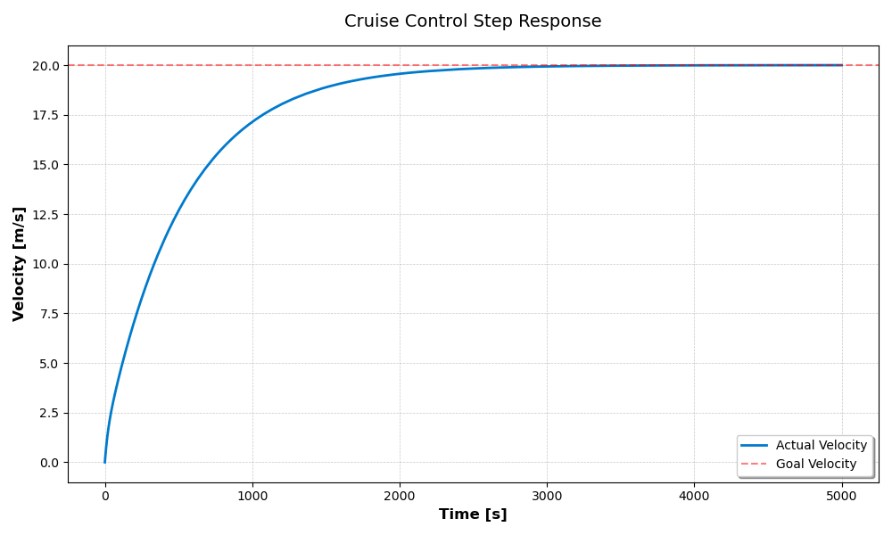

# C++ Autonomous Cruise Control Simulator

A physics-based simulation of a vehicle's cruise control system using a discrete **PID Controller**. This project implements a simplified dynamic vehicle model to simulate real-world velocity control, demonstrating Modern C++ practices, Object-Oriented Programming (OOP), and numerical integration.

---

## Table of Contents
1. [Project Structure](#-project-structure)
2. [Simulation Preview](#-simulation-preview)
3. [Features](#-features)
4. [How It Works](#-how-it-works)
5. [Installation & Build](#-installation--build)
6. [Usage](#-usage)
7. [Roadmap & Future Improvements](#-roadmap--future-improvements)
8. [Background & Evolution](#-background--evolution)

---
## Project Structure
```text
.
├── CMakeLists.txt          # Build system configuration
├── config.yaml             # External simulation & vehicle parameters
├── data/                   # Output folder for CSV and PNG plots
├── include/                # Header files
│   ├── cruise_control/     # Project core headers (Car, PID, Simulation, etc.)
│   └── third_party/        # External libraries (matplotlib-cpp)
├── src/                    # Source files (Implementation)
│   ├── main.cpp            # Application entry point & orchestration
│   └── ...                 # Other implementation files
└── plot_csv.py             # Optional Python script for manual plotting
```
---

## Simulation Preview
 
**Figure 1:** Velocity step response (0 to 20 m/s) with tuned parameters ($K_p = 5.0, K_i = 0.1, K_d = 0.5$).

---

## Features
- **Dynamic Vehicle Model:** Linearized car dynamics considering mass and velocity-proportional drag.
- **PID Control Logic:** Discrete implementation of Proportional, Integral, and Derivative terms for precise velocity regulation.
- **Numerical Integration:** Uses the **Explicit Euler Method** for stable state updates across discrete time steps.
- **Data Pipeline:** Automatic CSV export for telemetry analysis and external visualization.
- **Interactive CLI:** Built-in input validation for simulation parameters (starting velocity, target velocity, PID gains).
- **Built-in Visualization:** Integrated terminal-based preview of the simulation results.

---

## How It Works

### Vehicle Physics
The acceleration $a$ is computed using a linearized drag model:
$$a = \frac{F_{engine} - (d \cdot v)}{m}$$
Where $d$ is the friction coefficient, $v$ the current velocity, and $m$ the vehicle mass.

### PID Controller
The controller computes the required engine force ($u$) by evaluating the error ($e = v_{target} - v_{current}$):
- **P (Proportional):** Immediate reaction to the current error.
- **I (Integral):** Eliminates steady-state error by accumulating past errors.
- **D (Derivative):** Dampens the system by predicting future error trends.

### Numerical Solver
The velocity is updated at each timestep $\Delta t$ using Euler integration:
$$v_{t+1} = v_t + a \cdot \Delta t$$

---

## Installation & Build

### Prerequisites
- **C++17** or higher
- CMake (version **3.10+**)
- **YAML-cpp**: Library for parsing configuration files.
- Python 3
- **Python 3 Development Headers**: Required for the C++ plotting component.

### Install dependencies (Ubuntu/WSL)
```bash
sudo apt update
sudo apt install libyaml-cpp-dev python3-dev python3-matplotlib
```

### Build Instructions
```bash
# Clone the repository
git clone https://github.com/BrenzingerLuca/cruise_control_simulator.git
cd cruise_control_simulator/

# Create build directory
mkdir build && cd build

# Configure and build
cmake ..
make

# Run the simulation
./cruise_control
```

## Usage

1. **Configure**: Edit config.yaml in the root directory to set your desired simulation parameters (mass, PID gains, target velocity).
2. In the build folder run the following command:
```bash
# Run the simulation
./cruise_control
```
3. **Results**:The simulation will save a dataset to **data/my_cruise.csv**, and generate a plot at **data/my_cruise.png**.

Alternatively you can visualize the results using the provided Python script:

```bash
python3 plot_csv.py my_cruise.csv
```

## Roadmap & Future Improvements

This project is under active development. My goal is to transform this from a basic simulation into a robust control engineering tool. Planned features include:

### Software Architecture & Refactoring
- [x] **Encapsulation:** Implementation of a dedicated `Simulation` class to decouple the control loop from the `main` function, improving modularity and testability.
- [x] **YAML Configuration:** Moved from manual CLI input to external configuration files 
- [ ] **Unit Testing:** Integrating **GoogleTest (GTest)** to ensure the reliability of core PID logic and physics calculations.

### Advanced Physics & Control Engineering
- [ ] **Non-linear Dynamics:** Implementing aerodynamic drag ($v^2$) and rolling resistance for higher fidelity and more realistic vehicle behavior.
- [ ] **Anti-Windup Logic:** Adding Clamping/Back-calculation to handle actuator saturation (maximum engine force) and prevent integral windup.
- [ ] **Disturbance Simulation:** Introducing environmental factors like road gradients (uphill/downhill) to test and demonstrate controller robustness.
- [ ] **Performance Metrics:** Automatic calculation of Overshoot, Settling Time, and Steady-State Error after each run.


## Background & Evolution

This project was originally developed as a group assignment at the **Technical University of Munich (TUM)**.

*   **Initial Version (until Feb 2026):** Jointly developed by M. Schindler, E. Barilov, and L. Brenzinger.
*   **Current Maintainer:** Since the conclusion of the academic course, I have taken full ownership of the codebase. My ongoing work focuses on refactoring the architecture, further enhancing code quality, and implementing the advanced features outlined in the roadmap.