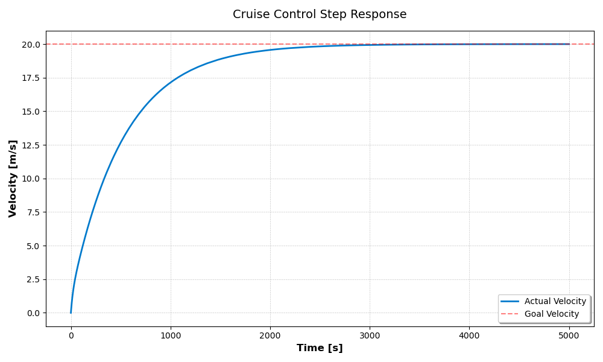

# C++ Autonomous Cruise Control Simulator

A physics-based simulation of a vehicle's cruise control system using a discrete **PID Controller**. This project implements a simplified dynamic vehicle model to simulate real-world velocity control, demonstrating Modern C++ practices, Object-Oriented Programming (OOP), and numerical integration.

---

## Table of Contents
1. [Project Structure](#-project-structure)
2. [Simulation Preview](#-simulation-preview)
3. [Features](#-features)
4. [How It Works](#-how-it-works)
5. [Installation & Build](#-installation--build)
6. [Usage](#-usage)
7. [Testing](#-testing)
8. [Roadmap & Future Improvements](#-roadmap--future-improvements)
9. [Background & Evolution](#-background--evolution)

---
## Project Structure<a name="-project-structure"></a>
```text
.
├── CMakeLists.txt          # Build system configuration
├── config.yaml             # External simulation & vehicle parameters
├── data/                   # Output folder for CSV and PNG plots
├── include/                # Header files
│   ├── cruise_control/     # Project core headers (Car, PID, Simulation, etc.)
│   └── third_party/        # External libraries (matplotlib-cpp)
├── src/                    # Source files (Implementation)
│   ├── main.cpp            # Application entry point & orchestration
│   └── ...                 # Other implementation files
└── plot_csv.py             # Optional Python script for manual plotting
```
---

## Simulation Preview<a name="-simulation-preview"></a>
 
**Figure 1:** Velocity step response (0 to 20 m/s) with tuned parameters ($K_p = 5.0, K_i = 0.1, K_d = 0.5$).

---

## Features<a name="-features"></a>
- **Non-linear Vehicle Model:** Linear friction, quadratic aerodynamic drag, rolling resistance, and a constant road grade (uphill/downhill) all act on the vehicle simultaneously.
- **PID Control Logic:** Discrete implementation of Proportional, Integral, and Derivative terms for precise velocity regulation.
- **Actuator Saturation & Anti-Windup:** Engine force is clamped to a configurable maximum, with conditional-integration anti-windup to prevent integral runaway while saturated.
- **Numerical Integration:** Uses the **Explicit Euler Method** for stable state updates across discrete time steps.
- **Data Pipeline:** Automatic CSV export for telemetry analysis and external visualization.
- **Interactive CLI:** Built-in input validation for simulation parameters (starting velocity, target velocity, PID gains).
- **Built-in Visualization:** Integrated terminal-based preview of the simulation results.
- **Performance Metrics:** Automatic calculation of Overshoot, Settling Time, and Steady-State Error, printed to the console after each run.

---

## How It Works<a name="-how-it-works"></a>

### Vehicle Physics
The acceleration $a$ is computed from the engine force minus all resisting forces:
$$a = \frac{F_{engine} - (d \cdot v) - (c_d \cdot v \cdot |v|) - (c_{rr} \cdot m \cdot g \cdot \text{sign}(v)) - (m \cdot g \cdot \sin\theta)}{m}$$
Where $d$ is the linear friction coefficient, $c_d$ the aerodynamic drag coefficient, $c_{rr}$ the rolling resistance coefficient, $\theta$ the road grade angle (derived from `road_grade_percent`), $v$ the current velocity, $m$ the vehicle mass, and $g$ gravity. Aerodynamic drag and rolling resistance always oppose the direction of travel, while the grade term acts as a constant disturbance (resisting uphill, assisting downhill).

### PID Controller
The controller computes the required engine force ($u$) by evaluating the error ($e = v_{target} - v_{current}$):
- **P (Proportional):** Immediate reaction to the current error.
- **I (Integral):** Eliminates steady-state error by accumulating past errors.
- **D (Derivative):** Dampens the system by predicting future error trends.

The raw PID output is clamped to `max_engine_force`, modeling a real actuator's saturation limit. To prevent the integral term from winding up while saturated, the controller uses **conditional-integration anti-windup**: the integral is only updated when the output is not saturated, or when doing so would pull the output back out of saturation.

### Numerical Solver
The velocity is updated at each timestep $\Delta t$ using Euler integration:
$$v_{t+1} = v_t + a \cdot \Delta t$$

### Performance Metrics
After each run, the `Metrics` class evaluates the recorded velocity trace against the goal velocity:
- **Overshoot:** The largest excursion above the goal, as a percentage of the goal velocity.
- **Settling Time:** The time after which the response stays within a ±2% tolerance band around the goal for the remainder of the run.
- **Steady-State Error:** The absolute difference between the final velocity and the goal velocity.

---

## Installation & Build<a name="-installation--build"></a>

### Prerequisites
- **C++17** or higher
- CMake (version **3.10+**)
- **YAML-cpp**: Library for parsing configuration files.
- Python 3
- **Python 3 Development Headers**: Required for the C++ plotting component.

### Install dependencies (Ubuntu/WSL)
```bash
sudo apt update
sudo apt install libyaml-cpp-dev python3-dev python3-matplotlib
```

### Build Instructions
```bash
# Clone the repository
git clone https://github.com/BrenzingerLuca/cruise_control_simulator.git
cd cruise_control_simulator/

# Create build directory
mkdir build && cd build

# Configure and build
cmake ..
make

# Run the simulation
./cruise_control
```

## Usage<a name="-usage"></a>

1. **Configure**: Edit config.yaml in the root directory to set your desired simulation parameters (mass, drag/resistance coefficients, road grade, PID gains, actuator limit, target velocity).
2. In the build folder run the following command:
```bash
# Run the simulation
./cruise_control
```
3. **Results**:The simulation will save a dataset to **data/my_cruise.csv**, and generate a plot at **data/my_cruise.png**.

Alternatively you can visualize the results using the provided Python script:

```bash
python3 plot_csv.py my_cruise.csv
```
## Testing<a name="-testing"></a>
To ensure the mathematical correctness of the PID controller and the physical fidelity of the vehicle model, this project uses **GoogleTest (GTest)** for automated unit and integration testing.

### Test Coverage:
- **PID Logic:** Verification of P, I, and D components, actuator saturation clamping, and anti-windup behavior, including error accumulation and steady-state behavior.
- **Vehicle Physics:** Validation of Newton's second law, friction-based deceleration, terminal velocity equilibrium, aerodynamic drag, rolling resistance, and road grade effects.
- **Integration Tests:** Full simulation runs verifying that the closed-loop system converges to the target velocity from different initial states (acceleration, deceleration, zero-state), with non-linear dynamics enabled, under a sustained uphill disturbance, and with a saturated actuator.
- **Performance Metrics:** Verification of overshoot, settling time, and steady-state error calculations on both synthetic velocity traces and a realistic simulation run.

### Running the Tests:
From the `build` directory, execute the test runner:
```bash
./run_unit_tests
```

## Roadmap & Future Improvements<a name="-roadmap--future-improvements"></a>

This project is under active development. My goal is to transform this from a basic simulation into a robust control engineering tool. Planned features include:

### Software Architecture & Refactoring
- [x] **Encapsulation:** Implementation of a dedicated `Simulation` class to decouple the control loop from the `main` function, improving modularity and testability.
- [x] **YAML Configuration:** Moved from manual CLI input to external configuration files 
- [x] **Unit Testing:** Integrating **GoogleTest (GTest)** to ensure the reliability of core PID logic and physics calculations.

### Advanced Physics & Control Engineering
- [x] **Non-linear Dynamics:** Implementing aerodynamic drag ($v^2$) and rolling resistance for higher fidelity and more realistic vehicle behavior.
- [x] **Anti-Windup Logic:** Adding clamping and conditional-integration to handle actuator saturation (maximum engine force) and prevent integral windup.
- [x] **Disturbance Simulation:** Introducing environmental factors like road gradients (uphill/downhill) to test and demonstrate controller robustness.
- [x] **Performance Metrics:** Automatic calculation of Overshoot, Settling Time, and Steady-State Error after each run.


## Background & Evolution<a name="-background--evolution"></a>

This project was originally developed as a group assignment at the **Technical University of Munich (TUM)**.

*   **Initial Version (until Feb 2026):** Jointly developed by M. Schindler, E. Barilov, and L. Brenzinger.
*   **Current Maintainer:** Since the conclusion of the academic course, I have taken full ownership of the codebase. My ongoing work focuses on refactoring the architecture, further enhancing code quality, and implementing the advanced features outlined in the roadmap.
